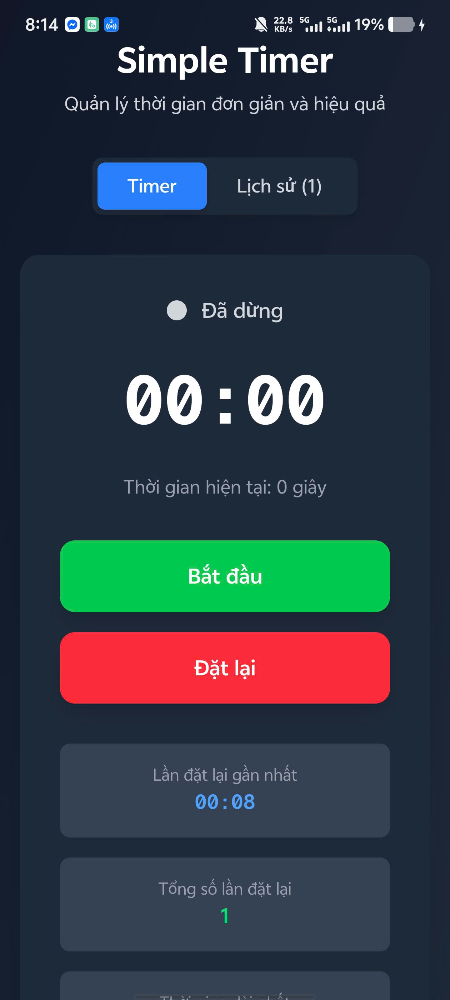
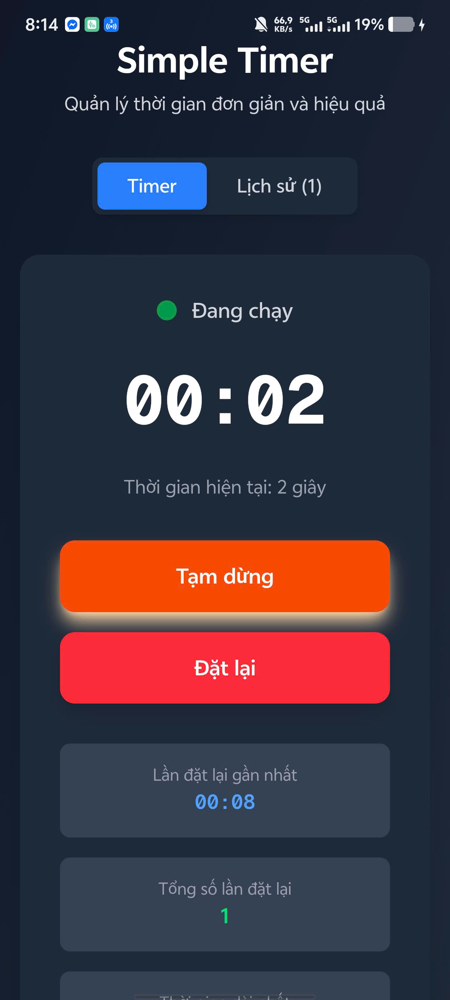

# Simple Timer - Time Management Application

## Student Information

- **Name**: Nguyen Thanh Truong
- **Student ID**: 22IT319
- **Project**: Simple Timer Mobile Application with Capacitor

## Project Overview

Simple Timer is a mobile application built with **Next.js**, **React**, **Capacitor**, and **TailwindCSS**. The app provides a clean and intuitive interface for time tracking with persistent storage capabilities.

### Key Features

-**Real-time Timer**: Accurate second-by-second counting using `setInterval()` -**Persistent Storage**: Timer state is automatically saved using Capacitor Preferences plugin -**Responsive Design**: Optimized for both mobile and desktop devices -**History Tracking**: Keeps track of all timer reset sessions with timestamps -**Statistics**: Quick stats showing recent resets, total resets, and longest session

## Technical Requirements Implementation

### Core Features Implemented

- Main screen with timer display (hours:minutes:seconds format)
- Three action buttons: Start, Pause, Reset
- History screen showing all reset timestamps
- Capacitor Preferences plugin for persistent storage
- setInterval() implementation for timer functionality
- Clean, responsive UI design
- Mobile-optimized interface

### Technical Stack

- **Frontend Framework**: Next.js 16 with React 19
- **Mobile Framework**: Capacitor 7.4.4
- **Styling**: TailwindCSS 4
- **Storage**: Capacitor Preferences Plugin
- **Language**: TypeScript
- **Platform**: Android (primary), Web (development)

## Installation & Setup

### Prerequisites

- Node.js 18+ and npm
- Android Studio (for Android development)
- Java Development Kit (JDK) 17+

### 1. Clone and Install Dependencies

```bash
cd capacitor
npm install
```

### 2. Install Capacitor Dependencies

```bash
npm install @capacitor/core @capacitor/preferences @capacitor/android
```

### 3. Development Mode (Web)

```bash
npm run dev
```

The application will be available at `http://localhost:3000`

### 4. Build for Mobile

```bash
# Build web assets
npm run build

# Sync with Capacitor
npx cap sync

# Open Android Studio
npx cap open android
```

### 5. Run on Android

```bash
# Build and run on Android device/emulator
npx cap run android
```

## Usage Instructions

### Main Timer Screen

1. **Start Timer**: Click the "Bắt đầu" (Start) button to begin counting
2. **Pause Timer**: Click the "Tạm dừng" (Pause) button to pause the timer
3. **Reset Timer**: Click the "Đặt lại" (Reset) button to reset to 0 and save to history

### History Screen

- Click the "Lịch sử" (History) tab to view all previous timer sessions
- Each entry shows the final time value and timestamp when reset was clicked
- History is automatically saved and persists between app sessions

### Persistent Storage Features

- Timer state (current time and running status) is automatically saved
- App remembers the exact timer state when reopened
- History of all reset sessions is permanently stored
- Up to 20 most recent history entries are kept

## Architecture & Code Organization

### Custom Hook: `useTimer`

The main timer logic is encapsulated in a custom React hook that handles:

- Timer state management (time, isRunning, history)
- Persistent storage with Capacitor Preferences
- setInterval management for accurate timing
- History tracking and management

### Component Structure

- **TimerDisplay**: Large, readable timer display with proper formatting
- **TimerControls**: Three main action buttons with responsive design
- **HistoryList**: Scrollable list of previous timer sessions
- **Main App**: Navigation and layout management

### Storage Implementation

```typescript
// Save timer state
await Preferences.set({
  key: "timer_state",
  value: JSON.stringify({ time: newTime, isRunning: newIsRunning }),
});

// Save history
await Preferences.set({
  key: "timer_history",
  value: JSON.stringify(historyArray),
});
```

## Build Commands

```bash
# Development
npm run dev                    # Start development server

# Production Build
npm run build                  # Build for production

# Mobile Development
npx cap sync                   # Sync web assets with mobile platforms
npx cap open android          # Open Android project in Android Studio
npx cap run android           # Build and run on Android device
```

## Screenshots

The application has been tested and verified to work on both web and Android platforms. Below are screenshots demonstrating the key features of the Simple Timer application.

<div style="display: flex; justify-content: space-around; align-items: flex-start; flex-wrap: wrap; gap: 20px; margin: 20px 0;">
  <div style="flex: 1; text-align: center; min-width: 300px;">
    
    <h4>Main Timer Interface</h4>
    <p><em>Clean, responsive design with large timer display and intuitive control buttons. Shows current time count and status indicator.</em></p>
  </div>
  <div style="flex: 1; text-align: center; min-width: 300px;">
    
    <h4>History Screen</h4>
    <p><em>Displays all previous timer reset sessions with timestamps. Complete timer usage history with detailed time records.</em></p>
  </div>
  <div style="flex: 1; text-align: center; min-width: 300px;">
    
    <h4>Running Timer with Statistics</h4>
    <p><em>Active timer showing real-time counting with statistics including recent resets, total sessions, and longest recorded time.</em></p>
  </div>
</div>

### Features Demonstrated:

1. **Timer Interface**: Clean, responsive timer display with large, readable numbers
2. **Control Buttons**: Intuitive start, pause, and reset functionality
3. **History Tracking**: Complete log of all timer sessions with timestamps
4. **Persistent Storage**: Timer state maintained across app restarts
5. **Mobile Optimization**: Touch-friendly interface optimized for mobile devices
6. **Real-time Updates**: Smooth second-by-second timer progression
7. **Statistics Overview**: Quick access to usage analytics and session data

## Development Log

- **Initial Setup**: Next.js + Capacitor project structure
- **Core Timer**: Implemented basic timer functionality with React hooks
- **Storage Integration**: Added Capacitor Preferences for data persistence
- **UI Design**: Created responsive interface with TailwindCSS
- **History Feature**: Implemented reset tracking and history display
- **Mobile Optimization**: Configured for Android platform
- **Testing**: Verified functionality on both web and mobile platforms

---

**Developed by**: Nguyen Thanh Truong (22IT319)  
**Technology Stack**: Next.js, React, Capacitor, TailwindCSS, TypeScript  
**Platform**: Android Mobile Application
